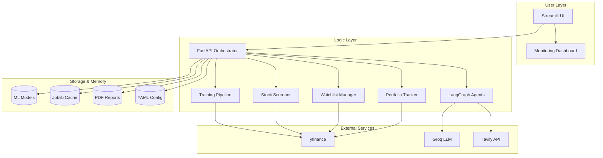

# 📈 Mini Stock Advisor

> A Streamlit-based stock intelligence dashboard for **single-stock analysis, universe screening, watchlist alerts, and portfolio tracking**.  
> Combines **ensemble forecasting**, **risk analytics**, and **LLM-powered reasoning** to help users evaluate stocks from **NIFTY 50**, **S&P 500**, or custom tickers.

---

## 📋 Table of Contents

- [Features](#features)
- [Tech Stack](#tech-stack)
- [Technical Architecture](#technical-architecture)
- [How It Works](#how-it-works)
- [Installation](#installation)
- [Run the App](#run-the-app)
- [Supported Universes](#supported-universes)
- [Example Workflows](#example-workflows)
- [Performance Optimizations](#performance-optimizations)
- [Future Improvements](#future-improvements)
- [Limitations](#limitations)
- [Disclaimer](#disclaimer)

---

## 🚀 Features

### 📊 Single-Stock Analysis
- Candlestick chart with technical indicators
- Forecasted price and upside estimate
- Risk metrics (volatility, Sharpe ratio, max drawdown)
- AI-generated stock commentary

### 🌍 Universe Screener
- Supports **NIFTY 50** and **S&P 500 Top 25/50**
- Ranks stocks by forecast upside and risk-adjusted metrics
- Cached scans for faster repeated runs

### ⭐ Watchlist + Alerts
- Add stocks to a personal watchlist
- Set target prices
- Trigger in-app alerts for:
  - Target price cross
  - Large daily moves
  - Downside risk

### 💼 Portfolio Dashboard
- Add holdings manually
- Track invested value, current value, P/L, returns %
- Allocation breakdown
- Portfolio volatility & Sharpe ratio

### 📄 Export Support
- Downloadable PDF stock reports

---

## 🧠 Tech Stack

| Layer | Tools |
| --- | --- |
| Frontend / UI | Streamlit |
| Backend API | FastAPI, Uvicorn |
| Data | yfinance, pandas, numpy |
| Visualization | Plotly |
| ML / Forecasting | scikit-learn, XGBoost, Prophet, joblib |
| LLM / Agents | LangGraph, LangChain Core, Groq |
| External APIs | Tavily (news/search) |
| Reporting | ReportLab (PDF generation) |
| Config / Env | python-dotenv, PyYAML |
| Deployment (Frontend) | Streamlit Cloud |
| Deployment (Backend) | Render |

---

## 🏗️ Technical Architecture



---

## ⚙️ How It Works

1. **Data Collection** — Fetches historical price data and basic fundamentals via `yfinance`
2. **Forecasting** — Uses an ensemble of ML + time-series models to predict short-term price movement
3. **Analysis** — Calculates returns, volatility, Sharpe ratio, max drawdown, and technical indicators (SMA, RSI)
4. **AI Commentary** — Generates natural-language insights using an LLM (Groq)
5. **Tracking** — Supports watchlists, alerts, and portfolio monitoring

---

## 🛠️ Installation

### 1. Clone the Repository

```bash
git clone https://github.com/ShaileshV-56/Mini-Stock-Advisor.git
cd Mini-Stock-Advisor
```

### 2. Create a Virtual Environment

**Windows**
```bash
python -m venv stockvenv
stockvenv\Scripts\activate
```

**macOS / Linux**
```bash
python3 -m venv stockvenv
source stockvenv/bin/activate
```

### 3. Install Dependencies

```bash
pip install -r requirements.txt
```

### 4. Set Environment Variables

Create a `.env` file in the root directory:

```env
GROQ_API_KEY=your_api_key_here
```

---

## ▶️ Run the App

```bash
streamlit run app.py
```

---

## 📌 Supported Universes

- Custom ticker input
- NIFTY 50
- S&P 500 Top 25 / Top 50

**Example tickers:**
AAPL MSFT NVDA
RELIANCE.NS TCS.NS INFY.NS


---

## 🔄 Example Workflows

| Workflow | Steps |
|---|---|
| **Single Stock** | Enter ticker → Choose forecast horizon → Click *Analyze Stock* |
| **Screener** | Select universe → Click *Scan Universe* |
| **Watchlist** | Add stock → Set target price → Monitor alerts |
| **Portfolio** | Add holdings → Track returns and allocation |

---

## ⚡ Performance Optimizations

- Cached data fetching for faster repeated scans
- Reusable indicator calculations
- Lazy model loading via `joblib`

---

## 🚧 Future Improvements

- [ ] Full S&P 500 support
- [ ] Sector-based screening
- [ ] Backtesting engine
- [ ] Email / Telegram alerts
- [ ] Persistent database
- [ ] Portfolio optimization
- [ ] CI/CD deployment

---

## ⚠️ Limitations

- Forecasts rely on historical patterns and may not capture sudden market events
- yfinance data can have gaps or delays
- LLM commentary is probabilistic, not verified financial research
- Limited to NIFTY 50 and S&P 500 Top 50 universes currently
- Portfolio data stored in-session only

---

## 📢 Disclaimer

**⚠️ Not Financial Advice.** Mini Stock Advisor is a personal learning project. All forecasts, signals, and AI-generated commentary are for educational purposes only. Do not make investment decisions based solely on this tool. Always consult a qualified financial advisor.

---

## 👤 Author

**Shailesh V**  
[](https://github.com/ShaileshV-56)
[](https://www.linkedin.com/in/shailesh56/)
